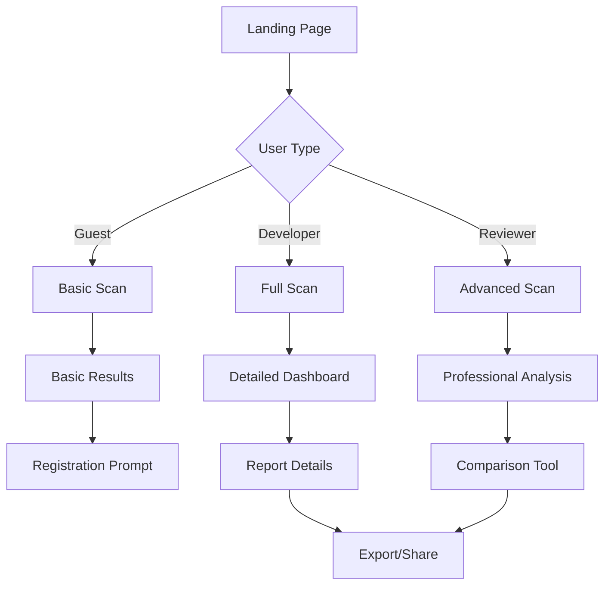

## 1. Product Overview
A Web3 security analysis tool that detects client-side risks in decentralized applications. The tool identifies XSS vulnerabilities, weak Content-Security-Policy implementations, and other security threats that could compromise Web3 wallets. Designed for Web3 developers, security reviewers, and hackathon judges to quickly understand and assess security risks through an intuitive interface.

The product solves the critical need for accessible Web3 security auditing by translating complex vulnerabilities into clear, actionable insights while maintaining a professional dark-mode aesthetic that aligns with Web3 industry standards.

## 2. Core Features

### 2.1 User Roles
| Role | Registration Method | Core Permissions |
|------|---------------------|------------------|
| Guest User | No registration required | Can run basic security scans, view limited results |
| Developer | Email/Web3 wallet connection | Full scan access, detailed reports, export functionality |
| Security Reviewer | Professional verification | Advanced analysis tools, comparison features, audit trails |

### 2.2 Feature Module
The Web3 security analysis tool consists of the following main pages:
1. **Landing Page**: Hero section, scan input, recent scans, feature overview
2. **Analysis Dashboard**: Real-time scan progress, risk summary, vulnerability list
3. **Report Details**: Detailed findings, wallet impact analysis, remediation steps
4. **Comparison Tool**: Side-by-side scan results, trend analysis (for reviewers)

### 2.3 Page Details
| Page Name | Module Name | Feature description |
|-----------|-------------|---------------------|
| Landing Page | Hero Section | Display tool value proposition with dark gradient background, animated security shield icon, and prominent "Start Security Scan" CTA button |
| Landing Page | URL Input | Single-line input field for dApp URL with Web3 protocol support (https://, ipfs://), real-time validation indicator |
| Landing Page | Quick Stats | Show scan count, vulnerabilities found, wallets protected with animated counters |
| Analysis Dashboard | Progress Monitor | Real-time scan progress bar with percentage, current test phase indicator, estimated time remaining |
| Analysis Dashboard | Risk Score Card | Large circular risk meter (0-100) with color-coded segments, overall risk level badge (Low/Medium/High) |
| Analysis Dashboard | Vulnerability List | Scrollable list of found issues with severity icons, brief descriptions, expandable details |
| Report Details | Detailed Findings | Categorized vulnerability breakdown with technical details, code snippets, and severity ratings |
| Report Details | Wallet Impact Modal | Interactive explanation of how each vulnerability could affect user wallets, with visual threat modeling |
| Report Details | Remediation Guide | Step-by-step fix instructions with code examples, priority recommendations, and time estimates |
| Comparison Tool | Scan History | Table view of previous scans with date, URL, risk score, and quick comparison toggle |
| Comparison Tool | Trend Analysis | Line chart showing risk score changes over time, vulnerability pattern detection |

## 3. Core Process

### Guest User Flow
1. User lands on homepage and enters dApp URL
2. System initiates security scan with progress indicator
3. Basic scan results display with limited detail view
4. Prompt to register for full detailed report

### Developer Flow
1. User connects Web3 wallet or registers with email
2. Access to full scan functionality with advanced options
3. Detailed vulnerability analysis with remediation guidance
4. Export reports in PDF/JSON formats
5. Access to scan history and comparison tools

### Security Reviewer Flow
1. Professional account verification and role assignment
2. Advanced scanning with custom parameters and deep analysis
3. Batch scanning capabilities for multiple dApps
4. Comprehensive audit trails and documentation tools
5. Collaboration features for team reviews

## 4. User Interface Design

### 4.1 Design Style
- **Primary Colors**: Deep purple (#6B46C1) for primary actions, bright green (#10B981) for safe/low risk, orange (#F59E0B) for medium risk, red (#EF4444) for high risk
- **Background**: Dark gradient (#0F0F23 to #1A1A2E) with subtle grid pattern, card backgrounds at #1E1E3F
- **Typography**: Inter font family, 16px base size, clear hierarchy with weights 400, 500, 600, 700
- **Button Style**: Rounded corners (8px), subtle shadows, hover states with 10% brightness increase
- **Layout**: Card-based design with 16px gaps, consistent 24px padding, responsive grid system
- **Icons**: Minimal line icons from Lucide React, consistent 20px size for UI elements

### 4.2 Page Design Overview
| Page Name | Module Name | UI Elements |
|-----------|-------------|-------------|
| Landing Page | Hero Section | Centered layout with gradient background, animated shield SVG (48px), headline "Secure Your Web3 dApp" in 36px bold, subtitle in 18px regular, primary CTA button (48px height) |
| Landing Page | URL Input | Full-width input (56px height) with protocol dropdown, scan button with loading spinner, input validation with green check/red X icons |
| Analysis Dashboard | Risk Score Card | Circular progress meter (200px diameter) with animated fill, risk level badge with background color matching severity, score number in 48px bold |
| Analysis Dashboard | Vulnerability List | Card-based items with severity color left border (4px), expandable accordion design, monospace font for technical details |
| Report Details | Wallet Impact Modal | Overlay modal with blurred background, visual threat diagram showing attack vectors, wallet icon with warning overlays |
| Report Details | Remediation Guide | Numbered steps with code syntax highlighting, copy-to-clipboard buttons, priority tags with color coding |

### 4.3 Responsiveness
- Desktop-first design with mobile adaptation
- Breakpoints: 320px, 768px, 1024px, 1440px
- Touch-optimized interactions with larger tap targets on mobile
- Collapsible navigation and stacked layouts for smaller screens
- Maintains dark theme consistency across all device sizes

### 4.4 Visual Hierarchy
- **Risk Levels**: Color-coded system with intuitive severity indicators
  - Low Risk: Green (#10B981) with checkmark icon
  - Medium Risk: Orange (#F59E0B) with warning triangle
  - High Risk: Red (#EF4444) with alert octagon
- **Information Priority**: Critical findings displayed prominently at top
- **Scan Progress**: Large, centered progress indicator with real-time updates
- **Call-to-Actions**: High contrast buttons with clear action labels
- **Technical Details**: Collapsible sections to avoid overwhelming non-technical users